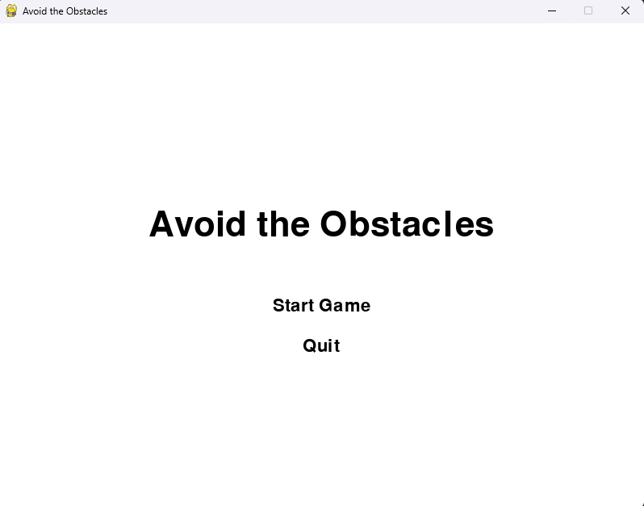

<br/>
<p align="center">
  <h3 align="center">Avoid The Obstacles</h3>

  <p align="center">
    An open source python game made with pygame
    <br/>
    <br/>
    <a href="https://github.com/Slimi1/Avoid-The-Obstacles/issues">Report Bug</a>
    .
  </p>
</p>

  

## About The Project



This is a basic python game. If you hit an obstacle then you lose the game. The game has a main menu and a game over screen.

## Getting Started


### Installation

3. Install python packages

```sh
pip install pygame
```

## Usage

Use arrow keys to move left and right


## Contributing

Contributions are what make the open source community such an amazing place to be learn, inspire, and create. Any contributions you make are **greatly appreciated**.
* If you have suggestions for adding or removing projects, feel free to [open an issue](https://github.com/Slimi1/Avoid-The-Obstacles/issues/new) to discuss it, or directly create a pull request after you edit the *README.md* file with necessary changes.
* Please make sure you check your spelling and grammar.
* Create individual PR for each suggestion.
* Please also read through the [Code Of Conduct](https://github.com/Slimi1/Avoid-The-Obstacles/blob/main/CODE_OF_CONDUCT.md) before posting your first idea as well.

### Creating A Pull Request

1. Fork the Project
2. Create your Feature Branch (`git checkout -b feature/AmazingFeature`)
3. Commit your Changes (`git commit -m 'Add some AmazingFeature'`)
4. Push to the Branch (`git push origin feature/AmazingFeature`)
5. Open a Pull Request

## License

Distributed under the MIT License. See [LICENSE](https://github.com/Slimi1/Avoid-The-Obstacles/blob/main/LICENSE.md) for more information.

## Authors

** - [Slimi1](https://github.com/Slimi1/) - **
